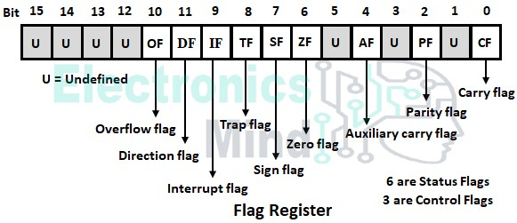

# I.  Fundamentals of Assembly Language

##     Binary Number Systems: Binary, Hexadecimal, Octal, Decimal

- Word: a 2-byte data item  
- Doubleword: a 4-byte (32 bit) data item  
- Quadword: an 8-byte (64 bit) data item
-  Paragraph: a 16-byte (128 bit) area 
-  Kilobyte: 1024 bytes
-  Megabyte: 1,048,576 bytes


| Decimal number | Binary representation | Hexadecimal representation |
| -------------- | --------------------- | -------------------------- |
| 0              | 0                     | 0                          |
| 1              | 1                     | 1                          |
| 2              | 10                    | 2                          |
| 3              | 11                    | 3                          |
| 4              | 100                   | 4                          |
| 5              | 101                   | 5                          |
| 6              | 110                   | 6                          |
| 7              | 111                   | 7                          |
| 8              | 1000                  | 8                          |
| 9              | 1001                  | 9                          |
| 10             | 1010                  | A                          |
| 11             | 1011                  | B                          |
| 12             | 1100                  | C                          |
| 13             | 1101                  | D                          |
| 14             | 1110                  | E                          |
| 15             | 1111                  | F                          |


### Role of Assembler and linker

-  Assembler: Converts .asm source to machine code (e.g., nasm, masm, gas)
-  Linker: Resolves symbols and creates an executable (ld, link)

--- 
##    Endianness: Little vs Big Endian
- Little Endian: Least significant byte stored first
> Example: 0x12345678 → 78 56 34 12

- Big Endian: Most significant byte stored first
> Example: 0x12345678 → 12 34 56 78

x86/x86_64 are Little Endian

--- 
##     Instruction Sets: x86, x86_64, ARM, MIPS, RISC-V

- x86: 32-bit Intel architecture (IA-32)
- x86_64: 64-bit extension (AMD64)
- ARM: Widely used in mobile/embedded devices
- MIPS: Common in embedded systems
- RISC-V: Open-source RISC architecture

--- 

##     CPU Architecture Basics (Registers, ALU, Stack, Heap, etc.)
- Registers: Small, fast storage inside the CPU
  -   General: EAX, EBX, ECX, EDX
  -   Stack: ESP, EBP
  -   Instruction: EIP (now RIP in x64)
- ALU: Executes arithmetic and logic instructions
- Control Unit: Directs instruction flow
- FPU/SIMD: For floating-point and vector ops
- Stack: LIFO data structure used for function calls
- Heap: Dynamically allocated memory region
- Code segment: Executable code
- Data segment: Static/global variables

--- 

##     Memory Addressing Modes

| Mode          | Example                | Meaning                   |
| ------------- | ---------------------- | ------------------------- |
| Immediate     | `MOV EAX, 1`           | Value is literal          |
| Register      | `MOV EAX, EBX`         | Value in another register |
| Direct        | `MOV EAX, [1234]`      | Value at memory address   |
| Indirect      | `MOV EAX, [EBX]`       | Address stored in EBX     |
| Base + Offset | `MOV EAX, [EBP+8]`     | Stack frame access        |
| Indexed       | `MOV EAX, [EBX+ECX*4]` | Array access              |

--- 
##     Instruction Format and Syntax (AT&T vs Intel)
### Mintel or Intel (used by IDA and WinDBG)
MOV destination, source

### AT&T (used by GDB)
mov source, destination

--- 
# II.  Core Assembly Programming Concepts
##     Registers and Register Classes (General, Segment, Control)


| 64-bit | 32-bit | 16-bit | 8-bit High | 8-bit Low | Use                         |
| ------ | ------ | ------ | ---------- | --------- | --------------------------- |
| RAX    | EAX    | AX     | AH         | AL        | Accumulator (math ops)      |
| RBX    | EBX    | BX     | BH         | BL        | Base (data access, loops)   |
| RCX    | ECX    | CX     | CH         | CL        | Counter (loops, shifts)     |
| RDX    | EDX    | DX     | DH         | DL        | Data (I/O, divisions)       |
| RSI    | ESI    | SI     | —          | SIL       | Source index (strings)      |
| RDI    | EDI    | DI     | —          | DIL       | Destination index (strings) |
| RBP    | EBP    | BP     | —          | BPL       | Base/frame pointer          |
| RSP    | ESP    | SP     | —          | SPL       | Stack pointer               |
| R8     | R8D    | R8W    | —          | R8B       | General purpose (x64 only)  |
| R9     | R9D    | R9W    | —          | R9B       | Same                        |
| R10    | R10D   | R10W   | —          | R10B      | Same                        |
| R11    | R11D   | R11W   | —          | R11B      | Same                        |
| R12    | R12D   | R12W   | —          | R12B      | Same                        |
| R13    | R13D   | R13W   | —          | R13B      | Same                        |
| R14    | R14D   | R14W   | —          | R14B      | Same                        |
| R15    | R15D   | R15W   | —          | R15B      | Same                        |


### Classic Purpose Registers
- RAX / EAX: Return value of functions, accumulator for arithmetic
- RBX: Sometimes preserved between calls (callee-saved)
- RCX: Loop counters, shift amounts, syscall arg (Windows)
- RDX: Second arg in Linux syscalls, math ops (e.g., DIV)
- RSI / RDI: Memory/string operations; argument passing
- RSP: Stack pointer – always points to top of the stack
- RBP: Frame pointer – helps with local variable access
- R8–R15: General-purpose, used for argument passing (SysV ABI)

Diagram



| Flag | Bit   | Meaning                          |
| ---- | ----- | -------------------------------- |
| CF   | 0     | Carry Flag – Unsigned overflow   |
| PF   | 2     | Parity Flag – Even # of set bits |
| AF   | 4     | Auxiliary Carry – BCD arithmetic |
| ZF   | 6     | Zero Flag – Result is zero       |
| SF   | 7     | Sign Flag – Result negative?     |
| TF   | 8     | Trap Flag – Single-step (debug)  |
| IF   | 9     | Interrupt Enable                 |
| DF   | 10    | Direction Flag (string ops)      |
| OF   | 11    | Overflow Flag – Signed overflow  |
| IOPL | 12–13 | I/O Privilege Level              |
| NT   | 14    | Nested Task                      |
| RF   | 16    | Resume Flag                      |
| VM   | 17    | Virtual-8086 Mode                |
| AC   | 18    | Alignment Check                  |
| VIF  | 19    | Virtual Interrupt Flag           |
| VIP  | 20    | Virtual Interrupt Pending        |
| ID   | 21    | Able to use CPUID instruction    |


--- 

## Syscalls
[[x86_32_syscalls.md]]
[[x86_syscalls.md]]
    
---

## Variable Storage Space

| Directive | Purpose            | Storage space |
| --------- | ------------------ | ------------- |
| DB        | Define Byte        | 1 byte        |
| DW        | Define word        | 2 byte        |
| DD        | Define double word | 4 byte        |
| DQ        | Define quad word   | 8 byte        |
| DT        | Define ten bytes   | 10 byte       |


## Allocating Storage Space for Uninitialized Data


| Directive | Purpose          |
| --------- | ---------------- |
| RESB      | Reserve a byte   |
| RESW      | Reserve 2 bytes  |
| RESD      | Reserve 4 bytes  |
| RESQ      | Reserve 8 bytes  |
| REST      | Reserve 10 bytes |


--- 
##     Data Movement Instructions (MOV, LEA, etc.)

### Basic Movement 


| Mnemonic | Meaning                  | Example                     |
| -------- | ------------------------ | --------------------------- |
| `MOV`    | Copy value               | `MOV EAX, EBX`              |
| `MOVZX`  | Move with Zero-Extension | `MOVZX EAX, BYTE PTR [EBX]` |
| `MOVSX`  | Move with Sign-Extension | `MOVSX EAX, BYTE PTR [EBX]` |
| `XCHG`   | Exchange values          | `XCHG EAX, EBX`             |
| `LEA`    | Load Effective Address   | `LEA EAX, [EBX+4*ECX]`      |


### Memory Access

| Access Type   | Example                  | Notes                     |
| ------------- | ------------------------ | ------------------------- |
| Direct        | `MOV EAX, [0x401000]`    | Absolute memory address   |
| Indirect      | `MOV EAX, [EBX]`         | Dereference register      |
| Base + Offset | `MOV EAX, [EBX+4]`       | Struct/array field access |
| Scaled Index  | `MOV EAX, [EBX+ECX*4]`   | Array element access      |
| Complex       | `MOV EAX, [EBX+ECX*4+8]` | Common in C structures    |


### Special movement instructions 


| Instruction | Description                              |
| ----------- | ---------------------------------------- |
| `MOVSx`     | Move string data (auto src/dest pointer) |
| `LODSx`     | Load string to accumulator               |
| `STOSx`     | Store accumulator to string              |
| `SCASx`     | Compare string with accumulator          |
| `CMPSx`     | Compare strings                          |


--- 
##     Arithmetic and Logic Instructions

### Arithmetic instructions

| Instruction | Description                         | Example        |
| ----------- | ----------------------------------- | -------------- |
| `ADD`       | Addition                            | `ADD EAX, 4`   |
| `SUB`       | Subtraction                         | `SUB EAX, 1`   |
| `INC`       | Increment (same as `ADD reg, 1`)    | `INC ECX`      |
| `DEC`       | Decrement                           | `DEC ESI`      |
| `NEG`       | Two’s complement negation           | `NEG EAX`      |
| `CMP`       | Compare (`SUB` but only sets flags) | `CMP EAX, EBX` |
| `ADC`       | Add with carry                      | `ADC EAX, 0`   |
| `SBB`       | Subtract with borrow                | `SBB EAX, 0`   |

- These set flags: ZF, SF, OF, CF, AF, PF

#### Multiplication and divisions

| Instruction | Description       | Notes                             |
| ----------- | ----------------- | --------------------------------- |
| `MUL`       | Unsigned multiply | Result in EDX\:EAX                |
| `IMUL`      | Signed multiply   | More flexible than `MUL`          |
| `DIV`       | Unsigned divide   | Dividend in EDX\:EAX              |
| `IDIV`      | Signed divide     | Quotient in EAX, remainder in EDX |


### Logic Instructions

| Instruction | Description             | Notes                              |
| ----------- | ----------------------- | ---------------------------------- |
| `AND`       | Bitwise AND             | Used to mask bits                  |
| `OR`        | Bitwise OR              | Set specific bits                  |
| `XOR`       | Bitwise XOR             | Common for zeroing: `XOR EAX, EAX` |
| `NOT`       | Bitwise NOT (inverts)   | One’s complement                   |
| `TEST`      | AND but only sets flags | Non-destructive `AND`              |

### Shift and Rotate

| Instruction | Description                                 |
| ----------- | ------------------------------------------- |
| `SHL`       | Logical shift left (×2^n)                   |
| `SHR`       | Logical shift right (÷2^n, unsigned)        |
| `SAL`       | Arithmetic shift left (same as SHL)         |
| `SAR`       | Arithmetic shift right (preserves sign bit) |
| `ROL`       | Rotate left                                 |
| `ROR`       | Rotate right                                |


--- 
##     Control Flow Instructions (JMP, JZ, JNZ, CALL, RET, etc.)


### unconditional

### Conditional

| Jump        | Meaning (Signed)     | Condition     |
| ----------- | -------------------- | ------------- |
| `JE`/`JZ`   | Equal / Zero         | ZF = 1        |
| `JNE`/`JNZ` | Not Equal / Not Zero | ZF = 0        |
| `JG`/`JNLE` | Greater              | ZF=0 & SF=OF  |
| `JGE`/`JNL` | Greater or Equal     | SF=OF         |
| `JL`/`JNGE` | Less                 | SF≠OF         |
| `JLE`/`JNG` | Less or Equal        | ZF=1 or SF≠OF |

| Jump        | Meaning (Unsigned)   | Condition     |
|-------------|----------------------|---------------|
| `JA`/`JNBE` | Above                | CF=0 & ZF=0   |
| `JAE`/`JNB` | Above or Equal       | CF=0          |
| `JB`/`JNAE` | Below                | CF=1          |
| `JBE`/`JNA` | Below or Equal       | CF=1 or ZF=1  |


--- 
##     Stack Operations (PUSH, POP, CALL, RET)

### Stack Movement


| Instruction | Meaning                           |
| ----------- | --------------------------------- |
| `PUSH X`    | Decrement `ESP`, store X on stack |
| `POP X`     | Load value from stack into X      |
| `CALL func` | Push return addr, jump to func    |
| `CALL`      | Push return addr, JMP             |
| `RET`       | Pop return addr and jump back     |


--- 
##     Function Calling Conventions (cdecl, stdcall, fastcall, sysv, etc.)
### What Are Calling Conventions?

- Calling conventions define:

 1.    How arguments are passed (via stack or registers)

 2.    How return values are passed

 3.    Who cleans up the stack (caller vs callee)

 4.    Which registers must be preserved

 5.    Crucial for:

    i.     Cross-language function calls (e.g., C to Assembly)

    ii.     Reverse engineering stack frames

    iii.    Exploit writing and ROP chains

### Stack Cleanup Responsibility

| Convention      | Stack Cleanup |
| --------------- | ------------- |
| `cdecl`         | Caller        |
| `stdcall`       | Callee        |
| `fastcall`      | Callee        |
| `SysV`          | Callee        |
| `Microsoft x64` | Callee        |


--- 
##     Parameter Passing and Return Values

### 📎 What Is Parameter Passing?

- Parameter passing refers to how arguments are transferred to functions or procedures when a call is made. Assembly depends on:

   1.  Calling conventions

   2.  Architecture (x86 vs x64)

   3.  OS ABI (Application Binary Interface)

###  32-bit (x86) Parameter Passing
-  Stack-Based (cdecl / stdcall)

  1.   Arguments are pushed onto the stack, right to left

  2.   Return value: stored in EAX

  3.   Accessed in function via [EBP + offset]

```asm

PUSH 2        ; arg2
PUSH 1        ; arg1
CALL add      ; add(1, 2)

```

### Function Prologue

```asm
add:
  PUSH EBP
  MOV EBP, ESP
  MOV EAX, [EBP+8]     ; arg1
  ADD EAX, [EBP+12]    ; arg2
  POP EBP
  RET
```

--- 
##     Looping Constructs in Assembly

```asm
MOV ECX, 5
.loop:
  ; do something
  LOOP .loop   ; decrement ECX, jump if not zero

;Modern Compiler
DEC ECX
JNZ .loop

```
--- 
##     Working with Strings and Buffers

### String and Buffer Instruction

| Instruction | Meaning                        |
| ----------- | ------------------------------ |
| `MOVSB`     | Move byte from [ESI] → [EDI]   |
| `MOVSW`     | Move word (2 bytes)            |
| `MOVSD`     | Move doubleword (4 bytes)      |
| `LODSB`     | Load byte into AL              |
| `STOSB`     | Store AL into [EDI]            |
| `SCASB`     | Compare byte in AL with [EDI]  |
| `CMPSB`     | Compare [ESI] with [EDI]       |


--- 
##     Macros and Assembly Directives


```asm
%macro SAVE_REGS 0
  PUSH EAX
  PUSH EBX
  PUSH ECX
%endmacro

SAVE_REGS
```

- %macro defines the macro.

- 0 is the number of arguments.

- Use the macro name (SAVE_REGS) like an instruction.

### macros with argument
```asm
%macro LOAD_IMM 2
  MOV %1, %2
%endmacro

LOAD_IMM EAX, 0x1337
```

- ✔️ %1, %2, etc. are placeholders for parameters.
Macros can generate readable, reusable logic blocks for things like syscall wrappers, context switches, saving/restoring register

--- 
##  SIMD and Floating Point Instructions

### SSE, AVX, and Vector Registers

| Name   | Width | Purpose                    |
|--------|-------|----------------------------|
| XMM0–XMM15 | 128-bit | SSE (Streaming SIMD Extensions) |
| YMM0–YMM15 | 256-bit | AVX (Advanced Vector Extensions) |
| ZMM0–ZMM31 | 512-bit | AVX-512 (High-performance SIMD)  |

### Common SIMD Instructions (Intel)

| Instruction     | Description                          |
|------------------|--------------------------------------|
| `MOVAPS`        | Move aligned packed single-precision |
| `MOVUPS`        | Move unaligned packed singles        |
| `ADDPS`         | Add packed singles                   |
| `MULPS`         | Multiply packed singles              |
| `PXOR`          | Bitwise XOR for integer vectors      |
| `PADDQ`         | Add packed quadwords                 |

> Requires CPU feature detection and proper alignment for max performance.

---
## II. Position-Independent Code (PIC)

### What is PIC?

Position-Independent Code can be loaded at **any memory address** and still function correctly, without relocation.

- Used in **shared libraries** and **shellcode**.
- Avoid absolute addresses – use **relative addressing** with `RIP` (x86_64).

```asm
    lea rdi, [rel message]
    call printf
```

---
## Inline Assembly (GCC / MSVC / Clang)
- GCC-Style Inline Assembly (x86/x64)
```cpp
int add(int a, int b) {
    int result;
    __asm__ (
        "addl %%ebx, %%eax;"
        : "=a"(result)
        : "a"(a), "b"(b)
    );
    return result;
}
```

- "=a" → output constraint (EAX)

- "a", "b" → input constraints

- Clobbers can be added with : : : "cc", "memory"

---
## Writing Shellcode (Linux/x86_64)

### Characteristics of Shellcode

- Must be position-independent

- Avoid null bytes (0x00)

- No external dependencies (no libc)

> [!EXAMPLE]  Example
>  Linux execve("/bin/sh")
```asm
section .text
global _start

_start:
    xor rax, rax
    mov rbx, 0x68732f6e69622f2f ; "//bin/sh"
    push rbx
    mov rdi, rsp
    xor rsi, rsi
    xor rdx, rdx
    mov al, 59         ; syscall execve
    syscall
```

> [!NOTE]  NOTE
> Use objdump -d to verify byte output and check for bad chars.


--- 
## System V ABI (Linux x64) vs Microsoft x64 ABI

### System V ABI (Linux/macOS)


| Argument # | Register |
| ---------- | -------- |
| 1          | RDI      |
| 2          | RSI      |
| 3          | RDX      |
| 4          | RCX      |
| 5          | R8       |
| 6          | R9       |
| Return     | RAX      |


- Caller-saved: RAX, RCX, RDX, R8–R11

- Callee-saved: RBX, RBP, R12–R15

### Microsoft x64 ABI (Windows)

| Argument # | Register |
| ---------- | -------- |
| 1          | RCX      |
| 2          | RDX      |
| 3          | R8       |
| 4          | R9       |

 - Return value in RAX

- Stack aligned to 16 bytes before call

--- 
## Multithreading and Atomic Instructions

### Atomic Instructions
| Instruction | Description                  |
| ----------- | ---------------------------- |
| `LOCK`      | Prefix for atomic operations |
| `XCHG`      | Atomic exchange              |
| `CMPXCHG`   | Compare and exchange         |
| `XADD`      | Exchange and add             |


- Use lock cmpxchg for atomic compare-and-swap loops.

--- 
## Exception Handling and Interrupts (x86)

### Software Interrupts

```asm
int 0x80      ; Linux syscall (x86)
```

### Hardware Interrupt Flow (simplified)

- Interrupt occurs

- CPU pushes flags, CS, and IP onto stack

- Jumps to address in IDT (Interrupt Descriptor Table)

### Return from Interrupt

- IRET or IRETD restores execution state

---
## Floating Point (x87 FPU)

### x87 Register Stack


- 8 registers: ST(0) to ST(7)

- Stack-style (push/pop) operations

### Basic FPU Instructions


| Instruction | Meaning                   |
| ----------- | ------------------------- |
| `FLD`       | Load floating-point value |
| `FSTP`      | Store and pop             |
| `FADD`      | Add ST(0) + ST(i)         |
| `FDIV`      | Divide ST(0) / ST(i)      |

--- 
## Security Concepts in Assembly
### Stack Smashing & Buffer Overflows

- Writing past local variables → overwrite return address

- Use NOP sled and shellcode payload

### Return-Oriented Programming (ROP)

- Chain together code snippets ("gadgets") ending in RET

-  Used in modern exploits to bypass DEP/NX

---
## Manual Linking and Binary Format (ELF / PE)
### ELF Format (Linux)

- Header

- Program headers (segments)

- Section headers (.text, .data, .bss)

> [!NOTE]  Note
> Use readelf, objdump, nm to inspect symbols.

```bash
readelf -h a.out
```

### PE Format (Windows)

- DOS Header

- PE Header

- Import Address Table

-  .text / .data / .rsrc sections


> [!NOTE] Note
> Use CFF Explorer, x64dbg, or PE-bear to inspect.

--- 
## CPUID and Feature Detection
### Example: Checking for AVX Support


```asm
mov eax, 1
cpuid
bt ecx, 28     ; AVX bit
jc avx_supported
```
- Use CPUID to query features, vendor strings, etc.

--- 
## Control and System Registers (x86 only)

| Register | Use                    |
| -------- | ---------------------- |
| CR0      | Paging, protected mode |
| CR2      | Page fault address     |
| CR3      | Page directory base    |
| CR4      | Feature flags          |


--- 
## inking Assembly With C (Multi-File Projects)

1. C File
```cpp
extern int my_asm_func(int);

int main() {
    return my_asm_func(5);
}
```

2. Assembly File (NASM)
```asm
global my_asm_func
section .text

my_asm_func:
    mov eax, edi      ; System V ABI: arg1 in EDI
    add eax, 2
    ret
```

3. Compile & Link:

```bash
nasm -f elf64 asmfunc.asm
gcc -no-pie main.c asmfunc.o
```

--- 
## Tools to use

| Tool      | Purpose                    |
| --------- | -------------------------- |
| `nasm`    | Assembler for Intel syntax |
| `objdump` | Disassemble binary files   |
| `gdb`     | Debugger                   |
| `strace`  | Syscall tracer (Linux)     |
| `ltrace` | Libcall Tracer (Linux) | 
| `radare2` | Reverse engineering        |
| `x64dbg`  | Windows debugging          |
| `Cutter`  | GUI for radare2            |
| `IDA Pro` | Debugger, Disassembler, Decompiler | 
| `Ghidra` | Debugger, Disassembler, Decompiler |
| `Binary Ninja` | Debugger, Disassembler, Decompiler | 


---
